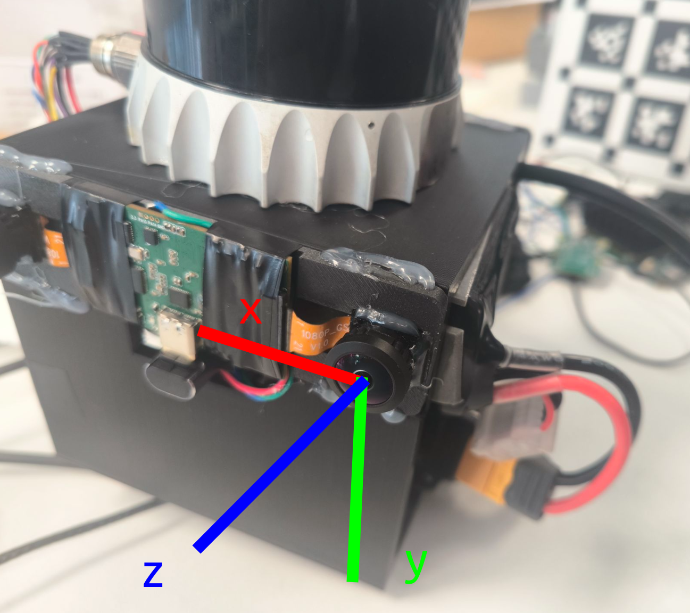

# Naive Lidar2Cam Calibration Tool

## Intro

This package provides a toolbox for LiDAR-camera calibration that is:

- Generalizable: Theoretically, it makes no difference for all LiDARs and cameras.

- Target-less: Of course, you don't need to purchase a calibration board.

- Multi-shot: Single-shot may not guarantee global optimality.

- Pure hand-eye calibration: This tool does not incorporate any optimization algorithms or deep learning algorithms.

## Inspiration

The community has many mature LiDAR-to-camera calibration tools like direct_visual_lidar_calibration and velo2cam_calibration. I haven't tested target-based methods yet (custom calibration targets are such a hassle). As for target-less methods, while I can obtain reasonably accurate rotation parameters (<1° error), the translation estimates often go completely off (>5 cm). Maybe we should just stick with traditional hand-eye calibration?

When projecting LiDAR point clouds back onto the image plane, the misalignment caused by extrinsic parameter errors becomes particularly noticeable for nearby objects. Generally speaking, if we've recorded a ROS bag containing LiDAR and image data, and our extrinsic parameters can ensure accurate alignment between the point cloud edges and image edges for most frames, we can reasonably conclude that the extrinsic calibration is accurate.

## Usage

### Installation

Currently only supports Ubuntu 20.04 with ROS dependencies.

```
pip install pyqt5 numpy opencv-python pyqtgraph rosbag scipy
```
### Data collection

The intrinsic parameters of the camera (i.e., camera matrix and distortion coefficients) need to be calibrated beforehand.

The image message type must be either ​sensor_msgs/CompressedImage or ​sensor_msgs/Image, and the LiDAR point cloud type must be ​sensor_msgs/PointCloud2.

Then, slowly move the device in an area with complex geometric structures for about 10 seconds (if IMU is not used for point cloud de-distortion, rapid movement will cause severe misalignment between the point cloud and images).

### Calibration

pinhole-radtan:

```
python lidar2cam_calib.py bag_file pinhole-radtan fx fy cx cy k1 k2 p1 p2
```
ds-none:

```
python lidar2cam_calib.py bag_file ds fx fy cx cy xi alpha
```

like:

``` 
python3 lidar2cam_calib.py ~/bag/4.14/calib.bag pinhole-radtan 1390.9387500713492 1392.8029594556217 637.8938889765367 483.14151449928954 -0.0940796259181304 0.1981182507080507 0.00047255100645406415 0.0009985666881676147

python3 lidar2cam_calib.py os0-fisheye-calib.bag ds 300.64792784590804 300.68442119906337 569.9991935258806 550.0942167886128 -0.17644991253371645 0.6700750864827676
```


Tips: Strongly recommend measuring the lidar2cam translation with a ruler first to provide a good initial guess — this will save significant time.



When most frames show good LiDAR-camera alignment, click ​**Save Extrinsic Parameters** to save the lidar2cam extrinsic calibration.

## Future work

- Support more projection and distortion models (pinhole, omni, eucm | radtan, equi, fov), though currently only ds-none and pinhole-radtan is implemented.
- Add point cloud and camera pose visualization and optimize UI.
- Add LiDAR-camera hardware sync trigger tutorial and implement point cloud de-distortion code.